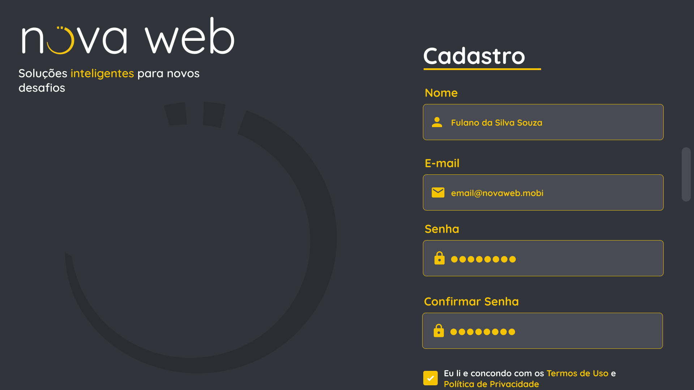
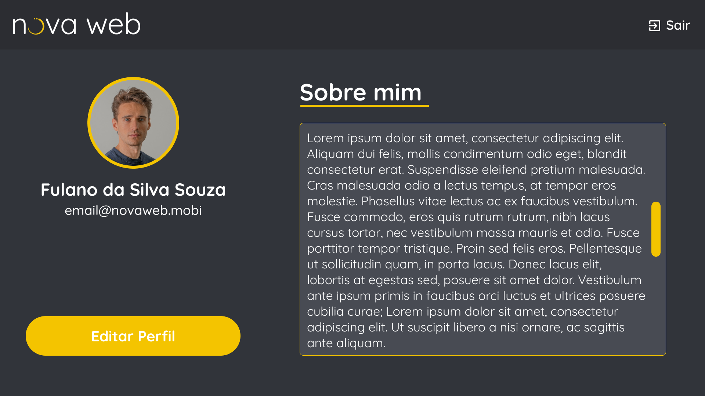
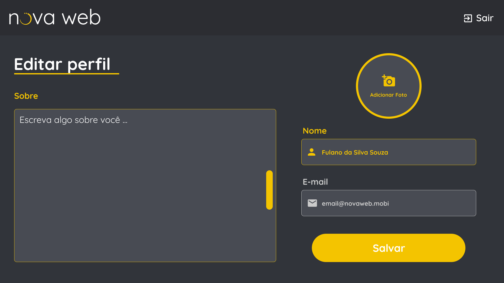

<h1 align="center">
    
</h1>
 

 <a href="#-sobre-o-desafio">Sobre</a> •
 <a href="#-instruções">Instruções</a> • 
 <a href="#-descrição-do-problema">Descrição</a> •
 <a href="#-avaliação">Avaliação</a> •
 <a href="#-dúvidas">Dúvidas</a> • 
 <a href="#-observações">Observações</a>

 

## 💻 Sobre o Desafio

Este desafio é parte do processo seletivo para a vaga "Desenvolvedor front-end" da empresa Nova Web. As habilidades esperadas de um desenvolvedor front-end são:

- Ser capaz de desenvolver aplicações multiplataforma em especial Web e Mobile utilizando linguagens e Frameworks modernos, por exemplo: JavaScript (React) e/ou Dart (Flutter).
- Ser capaz de realizar a conexão das aplicações front-end com APIs.
- Ter o conhecimento (bem) básico em prototipação de telas utilizando ferramentas como Figma, Adobe Xd, etc...
- Ser capaz de reproduzir a prototipação de telas na codificação do front-end.

### Neste desafio, buscamos compreender o seu nível nestas habilidades que são as necessárias para o cumprimento das tarefas diárias de um desenvolver front-end na Nova Web. Leia todo esse documento por completo para receber toda a instrução necessária para a realização do desafio.

---

## 📖 Instruções

Implemente sua solução e suba ela em um repositório público no GitHub. Em seguida, dentro do prazo estipulado (10 dias), **envie o link do repositório para celso@novaweb.mobi junto com seu currículo**.

Para cumprir este desafio você deve:

1. Implementar a solução para o problema utilizando JavaScript com as suas bibliotecas ou pacotes de sua preferência.
2. Implementar a solução para o problema utilizando um gerenciador de pacotes de sua preferência.

---

## ✍️ Descrição do problema

Neste desafio, você deverá implementar uma aplicação web onde um usuário pode se cadastrar, realizar login/logout e visualizar/editar o seu perfil na página. O layout a ser seguido está disponível no [Figma](https://www.figma.com/file/w42KdDbTvykXxRLBNC647j/Desafio-Nova-Web-Front-End?node-id=0%3A1) onde é possível exportar os assets como por exemplo a logo e consultar as cores e fontes utilizadas.

    
    
    
    

Além disso a API que deverá ser utilizada na integração com o back-end está disponivel no [Swagger](https://desafio-api.novaweb.duckdns.org:16443/swagger/index.html) que por sua vez possui os seguintes endpoints que devem ser utilizados da seguinte forma:

1. <b style="color:#49cc90">POST </b> **'/v1/user'** → Para registro do usuário.
2. <b style="color:#49cc90">POST</b> **'/v1/login'** → Para autenticação do usuário.
3. <b style="color:#f93e3e">DELETE</b> **'/v1/logout'** → Para logout do usuário.
4. <b style="color:#61affe">GET</b> **'/v1/profile'** → Para recuperas as informações do usuário.
5. <b style="color:#fca130">PUT</b> **'/v1/profile'** → Para atualizar as informações do usuário.

**Obs 1:** Quando um usuário é cadastrado um e-mail de confirmação é enviado para o e-mail inserido no cadastro e a conta só é ativada após o usuário clicar no link de confirmação.

**Obs 2:** Sempre que uma requisição da API da errado por exemplo: (Ao tentar recuperar as informações do usuário sem ele estar autenticado um o token JWT) a API retornará uma mensagem que pode ser mostrada no front para o usuário.

**Obs 3:** O usuário só pode atualizar seu nome, foto (imagem em base64) e bio.

---

## 📝 Avaliação

Serão avaliados os seguintes critérios:

- Se o seu código está bem escrito de acordo com o Clean Code.
- Saber explicar as razões e decisões técnicas da implementação da solução do problema.

---

## 📝 Dúvidas

Em caso de dúvidas envie um e-mail para **celso@novaweb.mobi**.

---

## 👀 Observações

Ao enviar a solução, você afirma que o trabalho entregue é fruto do seu próprio trabalho, exceto onde explicitamente especificado. Você também afirma que nenhuma licença está sendo violada pela solução implementada e entregue.
